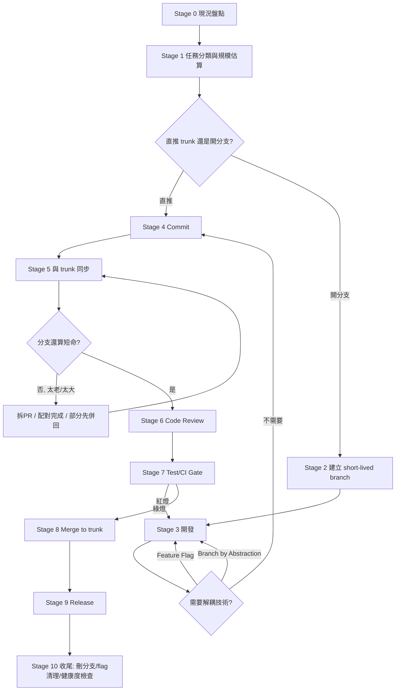

# 術：實際操作 SOP 與 Decision Tree

完整流程共 10 個階段（Stage 0–9），每個階段給「目的 / AI 該做什麼 / 判斷點 / 完成標準」。所有規則的詳細判斷依據在 [rules.md](rules.md)，這裡是把它們串成一條可執行的流水線。



## Stage 0：現況盤點（Evidence First）

見 [SKILL.md](../SKILL.md#stage-0啟動時必做盤點專案現況evidence-first) 的指令清單。輸出：trunk 名稱、活躍分支與年齡、CI 是否存在、flag 基礎設施是否存在、目前風格分類（TBD-like / Gitflow-like / 隨意）。若關鍵資訊仍缺（release 節奏、部署環境、flag 系統），先問，不進入 Stage 1。

## Stage 1：任務分類與規模估算

把當前任務歸類：
- **Bugfix（小）**：單一或少數檔案、行為修正、無架構影響。
- **Feature（使用者可見）**：會改變使用者看到/用到的行為。
- **Refactor（內部）**：不改變外部行為，但影響範圍大（模組替換、資料結構調整）。
- **Chore**：文件、設定、依賴升版、CI 設定等。
- **Large Migration**：跨模組、跨服務，或涉及資料庫 schema 的大改動。

同時估算：預期觸及檔案數、預估 diff 行數、是否單人可在 1–2 天內完成、是否會跨過其他人正在做的範圍。這些估算是後面所有 Decision Tree 的輸入。

## Stage 2：Branch or Direct Commit 判斷（Decision Tree #1）

```
變更是 trivial（單檔小修正）?
├─ 是 → 專案慣例允許直推 trunk（極小團隊/歷史顯示常態直推/無強制PR)?
│        ├─ 是 → 本地測試綠燈 → 直推 trunk（跳到 Stage 4）
│        └─ 否 → 走短命分支（下方）
└─ 否 → 走短命分支：
         git fetch && git checkout <trunk> && git pull
         git checkout -b <type>/<short-desc>   # 命名依專案既有慣例，無慣例則用 feat/ fix/ chore/
```
分支只綁一個人（或一對配對）；不要讓多人共用同一條 short-lived branch 做各自不同的工作。

## Stage 3：開發（含解耦判斷，Decision Tree #2）

開發期間：小步 commit、經常把 trunk 同步進分支，避免分支默默漂移。

```
預估完成時間 > 1 天，且會動到使用者可觸及的路徑?
├─ 是 → 加 Feature Flag（Release Toggle），flag 預設關閉
│        - 定義 flag 名稱/owner/預期存活期限
│        - 兩條路徑（flag on/off）都要有測試
└─ 否 → 是大範圍內部重構、呼叫端很多、使用者無感?
         ├─ 是 → Branch by Abstraction：
         │        1) 建抽象介面包住現有實作
         │        2) 逐步把呼叫端導向介面（zero-behavior-change commit）
         │        3) 新實作在介面後面小步建置
         │        4) 一次性切換 binding/factory（最小、最容易 revert 的一步）
         │        5) 驗證後刪舊實作，最後視需要刪抽象層
         └─ 否 → 是後端資料源/演算法替換，想拿真流量驗證?
                  ├─ 是 → Dark Launch / 並行執行，比對結果但不影響回應
                  └─ 否 → 不需要解耦技術，範圍夠小可直接整合
```

## Stage 4：Commit

依 [rules.md](rules.md#commit-規則) 的粒度與訊息慣例。每個 commit 盡量保持可獨立建置。

## Stage 5：與 trunk 同步（Integration 前檢查，Decision Tree #3）

合併前一定先把最新 trunk 拉進分支，確認沒有過時基準：
```
git fetch origin
git merge origin/<trunk>   # 或 rebase，依專案慣例
```
```
分支年齡 > 2天 或 diff > ~400行 或 同步時衝突明顯變多?
├─ 是（太老/太大） → 選一個：
│      a) 拆成更小的 PR / stacked PR
│      b) 今天內配對/專注完成
│      c) 用 Feature Flag 先併回安全的部分，剩下開新分支繼續
│      d) 若是重構造成的，改走 Branch by Abstraction
│   → 處理後回到 Stage 5 重新檢查
└─ 否 → 進入 Stage 6
```

## Stage 6：Code Review

開 PR（即使很短命）。優先請求同步或近同步審查；先確認自動化檢查（Stage 7）已經跑過或正在跑，人工審查聚焦邏輯與設計，不是重複機器已經做的事。PR diff 超過 ~400 行時提出拆分建議。

## Stage 7：Test / CI Gate

CI 必須綠燈才能進 Stage 8。若紅燈：回到 Stage 3 修，不要繞過。若是 flaky test 造成的偶發紅燈，標記隔離並回報，不要靠重跑到綠燈就當沒事。

## Stage 8：Merge to Trunk

依 [rules.md](rules.md#integration合併回-trunk-規則) 選合併策略（squash/merge commit/rebase）。合併後：
- 立即刪除該短命分支（PR 記錄保留，分支本身不需要留）。
- 確認 post-merge 的 trunk build 仍是綠的；若因為與其他人的變更組合後才出問題（Google 稱為 post-submit 失敗），優先 fix-forward，是別人的 commit 造成的則先確認再處理。

## Stage 9：Release（Decision Tree #4）

```
能持續部署、能快速fix-forward/回滾?
├─ 是 → 直接從 trunk 發布
│        若功能藏在 Feature Flag 後 → 發布 = 逐步調高 rollout 比例，不是重新部署
└─ 否（需多版本並存/上架審核/法規hardening) →
         就地切一條 release branch（可回溯到已知良好的 commit）
         release branch 絕不合併回 trunk；修復先進 trunk 再 cherry-pick 下去
```

## Stage 10：收尾

- 排入 Feature Flag 清理任務（到期或 100% rollout 後移除，這是 Definition of Done 的一部分，不是可選）。
- 掃描是否有分支因為這次工作而可以刪除。
- 視情境執行一次 [rules.md](rules.md#validation-rulestbd-健康度檢查) 的健康度檢查，尤其是在完成一個較大功能之後。
